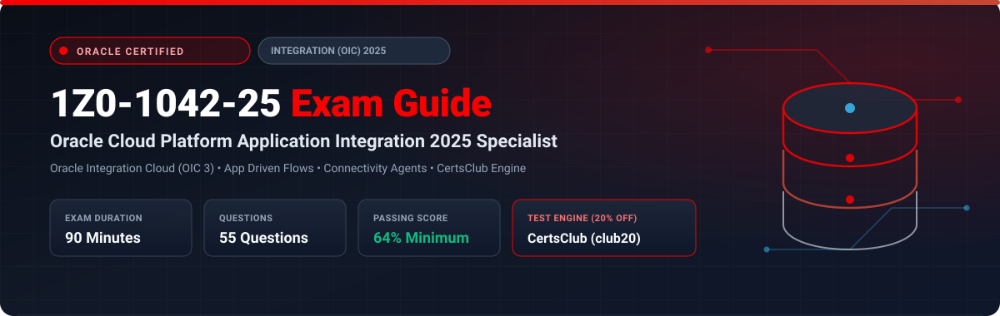

  

# Oracle Cloud Platform Application Integration 2025 Specialist (1Z0-1042-25) Exam Study Guide & Practice Test Resource Portal

[-f80000?style=for-the-badge&logo=oracle&logoColor=white)](https://education.oracle.com/)

[-28a745?style=for-the-badge&logo=shield)](https://www.certsclub.com/oracle/)

---

## 1. Exam Overview & Candidate Profile

The **Oracle Cloud Platform Application Integration 2025 Specialist (1Z0-1042-25)** exam validates a developer or architect's competence in designing, deploying, and managing enterprise integration flows using **Oracle Integration Cloud (OIC 3)**. Topics tested include App Driven and Scheduled integrations, REST/SOAP/File adapters, on-premises Connectivity Agents, advanced XSLT data mapping, fault handling frameworks, Process Automation, and B2B trading partner management.

Passing 1Z0-1042-25 grants the **Oracle Cloud Platform Application Integration 2025 Certified Specialist** credential.

### Target Candidate Profile & Career Roles
* **Enterprise Integration Architects & Middleware Developers**
* **OIC Solution Developers & Cloud Engineers**
* **ERP / CRM Technical Integration Consultants**

---

## 2. Key Exam Specifications

| Parameter | Official Specification |
| :--- | :--- |
| **Exam Code** | 1Z0-1042-25 |
| **Exam Title** | Oracle Cloud Platform Application Integration 2025 Specialist |
| **Associated Credential** | Oracle Cloud Platform Application Integration 2025 Certified Specialist |
| **Duration** | 90 Minutes |
| **Number of Questions** | 55 Questions |
| **Passing Score** | 64% |
| **Question Format** | Multiple Choice (Single and Multiple Select) |
| **Delivery Vendor** | Pearson VUE / Oracle University Online Remote Proctoring |
| **Recommended Practice Test Engine** | **[1Z0-1042-25 Practice Test - CertsClub](https://www.certsclub.com/oracle/)** (Coupon: `club20` for 20% off) |

---

## 3. Official Blueprint & Exam Domain Breakdown

| Domain Code | Domain Title | Weighting | Key Competencies Covered |
| :--- | :--- | :---: | :--- |
| **1.0** | **OIC Overview, Architecture & Provisioning** | **18%** | OIC 3 architectural components; Service provisioning and edition tiers (Standard vs Enterprise); Identity Domain security; Projects in OIC 3. |
| **2.0** | **Developing Integrations & Adapters** | **25%** | Integration styles (App-Driven, Scheduled, File Transfer, Event-driven); Configuring REST, SOAP, FTP, Database, and Oracle ERP/HCM Cloud adapters. |
| **3.0** | **Data Mapping, Transformations & Lookups** | **20%** | Visual Mapper, XSLT functions, advanced XPath expressions; Conditional mappings; Lookup tables and domain value maps (DVM). |
| **4.0** | **Error Handling & Fault Management** | **20%** | Scope-level fault handlers; Global fault handler; Error Hospital and re-submitting failed messages; Tracking business identifiers and primary keys. |
| **5.0** | **On-Premises Connectivity Agent & Security** | **17%** | Installing and configuring the On-Premises Connectivity Agent; High availability agent groups; OAuth 2.0 authentication policies; Token-based security. |

---

## 4. Scenario-Based Demo Question & Explanation

### Question 1: Fault Handling Architecture
**Scenario:** In an App-Driven integration, you want to catch an `APIInvocationError` that occurs when calling an external credit verification service. If the error occurs, the integration should log the error and notify an administrator, but allow the remainder of the parent orchestration to complete.

How should this error handling be architected in OIC?

A) Define a Global Fault Handler with an Exit action.  
B) Enclose the service invocation inside a **Scope** action, configure a Fault Handler on that Scope, and omit the `Rethrow` action inside the handler.  
C) Rely on OIC Error Hospital for manual intervention.  
D) Set the integration to asynchronous fire-and-forget.  

**Correct Answer:** **B**

**Detailed Explanation:**
* In Oracle Integration Cloud, localizing error handling to a **Scope** action allows catching specific faults. Because the fault handler does not contain a `Rethrow` action, the fault is marked as handled locally, allowing processing to resume with subsequent actions in the parent integration flow.

---

## 5. Recommended Preparation Strategy & Practice Testing Engine

1. **Build Real Integrations in OIC 3:** Configure scheduled file processing and REST trigger integrations with transformation lookups.
2. **Practice with Full-Length Mock Exams:** Use **[CertsClub Oracle 1Z0-1042-25 Practice Tests](https://www.certsclub.com/oracle/)**.
   * Tests real OIC 3 adapter parameters, XSLT functions, and fault scopes.
   * Enter discount coupon code **`club20`** at checkout on [CertsClub](https://www.certsclub.com/oracle/) for an immediate 20% discount.

---

## 6. Official Documentation & References

* [Oracle Integration Documentation](https://docs.oracle.com/en/cloud/paas/application-integration/)
* [Oracle University 1Z0-1042-25 Exam Details](https://education.oracle.com/)
* [CertsClub 1Z0-1042-25 Practice Engine](https://www.certsclub.com/oracle/)
